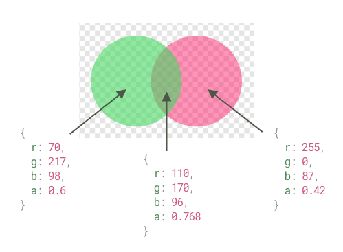

<div align="center">
  <br>
  <br>

  

  <br>
</div>

# color-blend

[](https://travis-ci.org/Loilo/color-blend)
[](https://ci.appveyor.com/project/Loilo/color-blend)
[](https://greenkeeper.io/)
[](https://standardjs.com)
[](https://npmjs.com/package/color-blend)


> Blends RGBA colors with different blend modes

This is a zero-dependency JavaScript implementation of the blend modes introduced in the [W3C Compositing and Blending spec](https://www.w3.org/TR/compositing-1/).

Altogether it's a whopping 1.1 KB small (minified & gzipped), going down to as far as 0.4 KB if you use just one blending method and a [tree-shaking](https://en.wikipedia.org/wiki/Tree_shaking) bundler.

## Install
```console
$ npm install --save color-blend
```

## Usage

### Example
It's really easy to wrap your head around. Consider the following simple example:

```js
// Using vanilla Node.js
const { normal } = require('color-blend')

// Using a bundler? It will automatically pick up a
// tree-shakeable ES modules version of color-blend:
import { normal } from 'color-blend'


// Mix some green and pink
const background = { r: 255, g:   0, b: 87, a: 0.42 }
const foreground = { r:  70, g: 217, b: 98, a: 0.6  }

normal(background, foreground)
// returns { r: 110, g: 170, b: 96, a: 0.768 }
```

Be the way, those are the colors from the logo above. See?



### Explanation
This module provides an implementation for all blend modes listed in the aforementioned W3C document, which are:

* `normal`
* `multiply`
* `screen`
* `overlay`
* `darken`
* `lighten`
* `colorDodge`
* `colorBurn`
* `hardLight`
* `softLight`
* `difference`
* `exclusion`
* `hue`
* `saturation`
* `color`
* `luminosity`

All those methods have the same API: they take a `background` and a `foreground` color as arguments.
Those are expected to be RGBA colors, similar to how they appear in CSS — represented as plain objects containing the keys

* `r`, `g`, `b` (each ranging from 0 to 255)
* `a` (ranging from 0 to 1)

The result of the blending operation will be returned as such an RGBA object as well.

### Unit Colors
If you need higher precision (resulting RGB channels will be rounded to integers!) or just have a different flavor, this package offers an entry point `/unit`, where all accepted and returned color channels are values between 0 and 1:

```javascript
import { normal } from 'color-blend/unit'

// Still mix some green and pink
const background = { r:  1,    g: 0,    b: 0.34, a: 0.42 }
const foreground = { r:  0.27, g: 0.85, b: 0.38, a: 0.6  }

normal(background, foreground)
// returns { r: 0.43, g: 0.665, b: 0.372, a: 0.768 } (rounded to 3 decimals)
```

## Thanks
A special "thank you" goes to [Christos Lytras](https://github.com/clytras) who helped me [digging deep](https://stackoverflow.com/questions/40796852/mix-two-non-opaque-colors-with-hue-blend-mode) into the rabbit hole of color blending.
